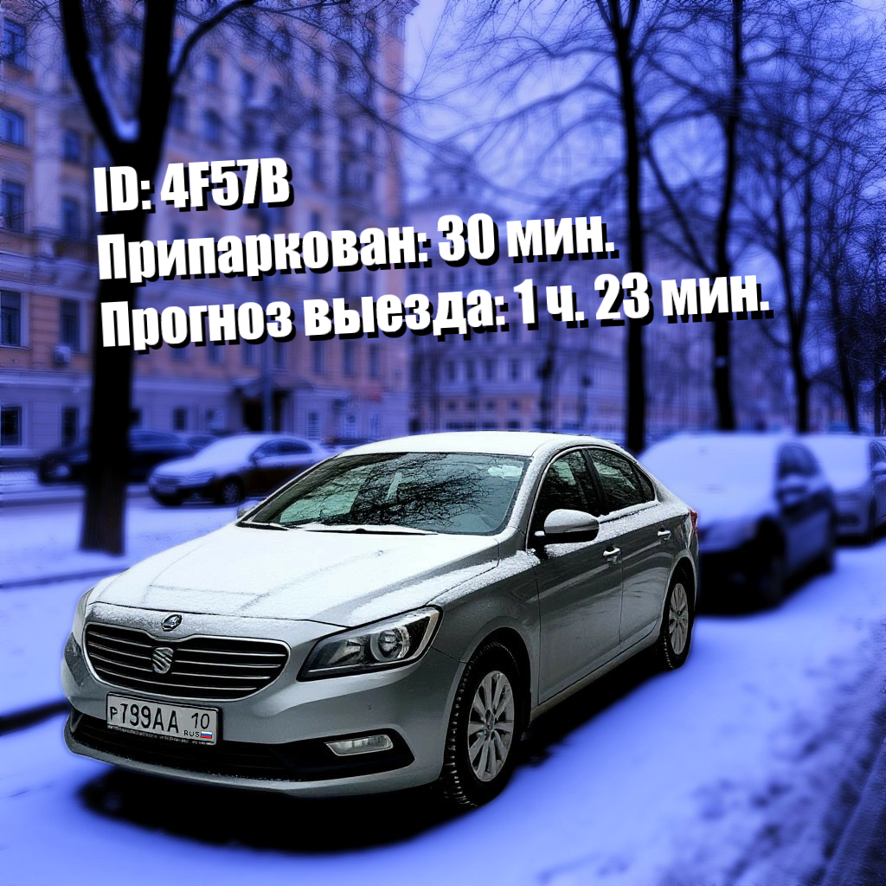
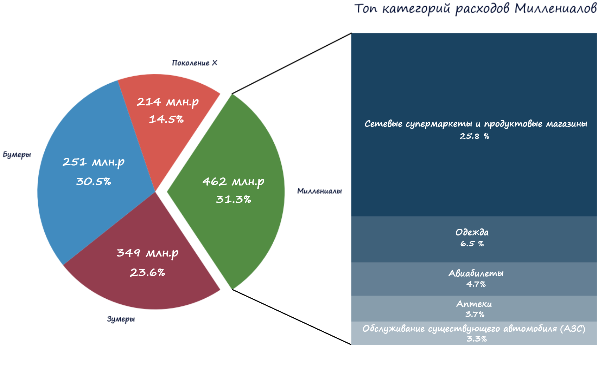

  

 

<picture>
  <source media="(prefers-color-scheme: dark)" srcset="dark_theme_startup_title.png">
  <source media="(prefers-color-scheme: light)" srcset="light_theme_startup_title.png">
  
</picture>

  
### [Система мобильного мониторинга парковочных зон]()

&nbsp;&nbsp; Я думаю каждый житель мегаполиса часто сталкивается с проблемой поиска свободного места на парковке. 
&nbsp;&nbsp; Постоянное катание по дворам выматывает, тратит нервы, время, бензин, загрязняет воздух и как итог, не найдя места, многие бросают автомобили нарушая ПДД. 
&nbsp;&nbsp; Но, что если у нас появится возможность немного заглянуть в будущее и с большой уверенностью сказать, что
к моменту, когда я подъеду к парковке, у дома 45 место будет свободно? 
&nbsp;&nbsp;Звучит как чудо, но данный проект на основе каскада нейронных сетей делает именно это.

<picture>
  <source media="(prefers-color-scheme: dark)" srcset="dark_theme_skills_title.png">
  <source media="(prefers-color-scheme: light)" srcset="light_theme_skills_title.png">
  
</picture>

<picture>
  <source media="(prefers-color-scheme: dark)" srcset="Sberb_analysis.png" align='right' width='50%'>
  <source media="(prefers-color-scheme: light)" srcset="Sberb_analysis_w2.png" align='right' width='50%'>
  
  
### [Исследовательский анализ данных (EDA)](https://github.com/AntonAlferov/visualization)
Моя отчасти творческая работа по анализу данных на основе визуализации с использованием matplotlib и
seaborn. Сами данные взяты с открытых источников. Помимо небольших тренирочных анализов.
В данный репозиторий включено собственное решение соревнования по
анализу банковских транзакций от Сбера.
