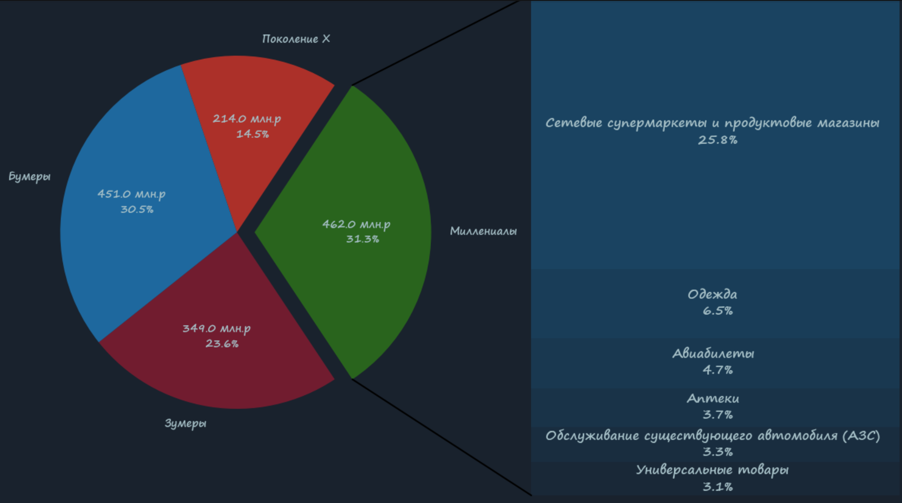

  

 

<picture>
  <source media="(prefers-color-scheme: dark)" srcset="dark_theme_startup_title.png">
  <source media="(prefers-color-scheme: light)" srcset="light_theme_startup_title.png">
  
</picture>
<picture>
  <source media="(prefers-color-scheme: dark)" srcset="dark_theme_skills_title.png">
  <source media="(prefers-color-scheme: light)" srcset="light_theme_skills_title.png">
  
</picture>

### Исследовательский анализ данных (EDA)
Моя отчасти творческая работа по анализу данных на основе визуализации с использованием matplotlib и
seaborn. Сами данные взяты с открытых источников.
Помимо небольших тренирочных анализов.
В данный репозиторий включено собственное решение соревнования по
анализ банковских транзакций от Сбера (на тот момент Сбербанка).
